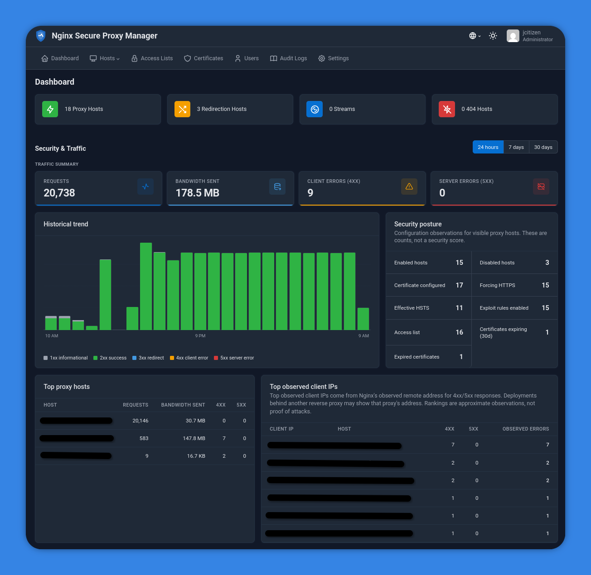

<p align="center">
  
</p>

# Nginx Secure Proxy Manager

**Nginx Secure Proxy Manager (NSPM)** is a security-focused, unofficial fork of [Nginx Proxy Manager](https://github.com/NginxProxyManager/nginx-proxy-manager). It retains NPM's approachable reverse-proxy, certificate, access-list, and user-management experience while adding security visibility features, beginning with the security and traffic dashboard.

> NSPM is independently maintained by [CyberSec.Cam](https://www.cybersec.cam) / [creimer808](https://github.com/creimer808). It is not affiliated with, endorsed by, or supported by NGINX, Inc. or the official Nginx Proxy Manager project.

## Versions and compatibility

| Version | Value |
| --- | --- |
| NSPM application | `0.1.2` |
| Nginx Proxy Manager compatibility baseline | `2.15.1` |

NSPM releases use their own semantic version (`v0.1.2`). The upstream baseline is shown separately so users can determine which stable NPM release supplied the core behavior. See [UPSTREAM.md](UPSTREAM.md) for the synchronization policy.

## Features

- NPM-compatible proxy hosts, redirections, streams, certificates, access lists, users, permissions, and audit log.
- A security and traffic dashboard for recent request volume, status trends, and potentially suspicious sources.
- A permission-aware Security investigation page with attributed built-in rule matches, searchable detailed events, raw-log browsing, and bounded retention.
- Let's Encrypt certificates, custom certificates, and advanced Nginx configuration.
- Multi-architecture container images for `amd64` and `arm64`.

## Quick setup

1. Install [Docker](https://docs.docker.com/get-docker/) and Docker Compose.
2. Create `docker-compose.yml`:

```yaml
services:
  app:
    image: ghcr.io/creimer808/nginx-secure-proxy-manager:0.1.2
    restart: unless-stopped
    ports:
      - "80:80"
      - "81:81"
      - "443:443"
    volumes:
      - ./data:/data
      - ./letsencrypt:/etc/letsencrypt
```

3. Start it with `docker compose up -d`.
4. Open [http://127.0.0.1:81](http://127.0.0.1:81) and complete initial setup.

Pin an NSPM image digest in production. A numbered tag identifies a release but can only be relied on as immutable when GitHub release-tag protection and GHCR tag immutability are enforced; `latest` is intentionally mutable.

## Security dashboard

The dashboard is designed to make proxy activity easier to review without replacing a SIEM, IDS, or log-retention program. It summarizes access-log data locally and applies bounded retention. Validate decisions against your authoritative logs and monitoring systems before taking action.

The top-level **Security** page provides request-level events, stable built-in rule attribution, administrator-only global/fallback logs, authorized per-host raw logs, and configurable 7–365 day detailed-event retention. Full URIs and query strings are retained, so review the privacy, storage, client-IP trust, upgrade, and operational guidance in [Security investigation](docs/security-investigation.md) before enabling the feature on sensitive workloads.

<p align="center">
  
</p>

## Upstream relationship and attribution

This project is built on the work of [Jamie Curnow](https://github.com/jc21), the [Nginx Proxy Manager contributors](https://github.com/NginxProxyManager/nginx-proxy-manager/graphs/contributors), and the wider open-source community. The core feature set remains based on Nginx Proxy Manager. NSPM preserves the upstream MIT license and its notices; CyberSec.Cam's fork-specific changes are also MIT licensed.

- Upstream project: <https://github.com/NginxProxyManager/nginx-proxy-manager>
- NSPM repository: <https://github.com/creimer808/nginx-secure-proxy-manager>
- CyberSec.Cam: <https://www.cybersec.cam>

## Support and contributions

Please open NSPM bugs and feature requests in this repository, including **both** the NSPM and upstream compatibility versions displayed in the UI. For behavior that reproduces on an unmodified upstream image, report it upstream instead.

See [SECURITY.md](SECURITY.md) for responsible vulnerability reporting and [UPSTREAM.md](UPSTREAM.md) for the stable-release synchronization workflow.

## Roadmap

Planned fork-specific work includes richer security telemetry, dashboard improvements, and operational security features. These are roadmap items, not guarantees; compatibility and secure maintenance take priority.
